# Informe de la Resolución del Proyecto

*M2 Blocks - Lógica para Cs. de la Computación - 2025*

**Comisión `[74]`**:

- Tapia, Leandro
- Mezquita, Francisco

---

##### **INTRODUCCIÓN**

Este informe detalla la implementación de "M2 Blocks" un videojuego de puzzle y estrategia cuyo objetivo es lanzar y combinar bloques numerados para crear bloques de mayor valor y ganar puntos, utilizando **Prolog** para la lógica del backend y **React** para la interfaz de usuario. El objetivo principal fue crear una experiencia de juego interactiva y robusta, donde Prolog se encarga de las reglas complejas del juego y la evaluación de estados, mientras que React proporciona una representación visual atractiva y una interacción fluida con el usuario.

---

##### DESARROLLO DEL PROYECTO

###### **Lógica del Juego**

Aprovechando las capacidades para el **razonamiento declarativo** y el **manejo de relaciones** que brinda Prolog, desarrollamos las siguientes estrategias de resolución:

* **Generación Aleatoria de Bloques (`randomBlock/2`):**
  * Estrategia: La generación de nuevos bloques no es puramente aleatoria. Se calculan los **rangos de valores posibles** para los nuevos bloques (2, 4, 8, etc.) basándose en el  **valor máximo actual en la grilla** . Esto asegura que el juego no se inunde con bloques de bajo valor a medida que el jugador avanza.
  * Funcionalidad Extra**:** Se implementó una lógica de **"bloques a retirar"** que, a medida que el valor máximo en la grilla aumenta (por ejemplo, superando 1024, 2048, etc.), ciertos bloques de bajo valor (2, 4, 8) se eliminan del rango de posibles bloques a generar. Esto fuerza al juego a progresar y evita la acumulación excesiva de bloques pequeños en etapas avanzadas.
* **Disparo de Bloques y Flujo del Juego (`shoot/5`)**:
  * Estrategia: El predicado `shoot/5` es el corazón de la interacción. Primero, se **identifica la posición vacía más baja** en la columna seleccionada. Luego, se coloca el bloque disparado. A partir de aquí, el juego entra en un ciclo de "resolución de pasos" que incluye:
    1. Aplicación de Gravedad: Los bloques "caen" para ocupar espacios vacíos.
    2. Búsqueda y Combinación de Bloques: Se identifican y resuelven grupos de bloques adyacentes con el mismo valor que deben combinarse.
    3. Limpieza de Bloques Retirados: Tras las combinaciones y si el valor máximo lo justifica, se eliminan los bloques de bajo valor de la grilla, tal como se describió en la generación de bloques.
* **Búsqueda de Grupos Conectados (`encontrar_grupo_conectado/6`):**
  * Estrategia: A partir de una posición inicial, se buscan recursivamente todos los bloques adyacentes con el mismo valor, construyendo un "grupo conectado". Este predicado es fundamental para identificar los bloques que se combinarán. La implementación asegura que cada grupo se identifique una única vez.
* **Generación de Pistas (`get_hint/6`):**
  * Estrategia: Simula un disparo para cada columna posible y  **evalúa los efectos resultantes** . No simplemente propone una columna al azar, sino que ejecuta toda la secuencia de juego (gravedad, combinaciones) para cada opción y devuelve los efectos que se producirían.

**Dificultades y Cómo se Enfrentaron**

* **Coordinación de Efectos:** En un principio, el manejo de la secuencia de eventos (gravedad -> combinación -> gravedad post-combinación -> limpieza) era complejo.
  * Solución: Se optó por un bucle recursivo en `resolver_pasos_juego` que, en cada iteración, aplica gravedad y luego busca combinaciones. Si se encuentran combinaciones, se recurre. Si no hay combinaciones, se verifica la limpieza de bloques retirados. También se tuvo mucho cuidado con el delay entre disparo y disparo, y se trató de minimizar lo máximo posible.
* **Posición de Resultado de Combinación:** Determinar dónde debe aparecer el nuevo bloque resultante de una combinación.
  * Solución: Se priorizó la posición del bloque disparado si era parte de la combinación. Si no, se elige la posición con el índice más bajo dentro del grupo combinado.
* **Optimización del Rendimiento para "Hints":** Calcular los hints implicaba simular movimientos para cada columna, lo que podría ser costoso computacionalmente.
  * Solución: Se optimizaron las reglas de Prolog para que las búsquedas y las inferencias fueran lo más eficientes posible.

###### **Interfaz de Usuario**

La implementación en **React** se centró en proporcionar una  **interfaz de usuario dinámica e intuitiva** , que reacciona a los eventos del backend de Prolog y visualiza los cambios de la grilla de manera fluida.

**Aspectos Destacados de la Implementación en React**

* **Comunicación Cliente-Servidor.**
* **Manejo de Estados:** React maneja el estado de la grilla y los efectos del juego. Cuando Prolog devuelve una lista de efectos, React itera sobre ellos, actualizando el estado de la grilla y desencadenando animaciones para cada paso (disparo, caída, combinación), asegurando una experiencia fluida.
* **Animaciones.**

**Desafíos Encontrados y Cómo se Enfrentaron:**

* **Sincronización de Estados:** Mantener el estado del tablero sincronizado entre Prolog y React requirió un manejo cuidadoso de las actualizaciones.
* **Visualización de Hints Complejos:** Mostrar la información de los hints de manera legible y no intrusiva. Se diseñó un formato de texto conciso para los hints (ej. "COMBO x2 (+100 pts)"), y se usaron overlays semi-transparentes para que no bloquearan completamente la vista del tablero subyacente.

---

##### CASOS DE TEST SIGNIFICATIVOS

A continuación, se presentan capturas de pantalla que ilustran funcionalidades clave y escenarios específicos del juego, especialmente la interacción entre React y Prolog.

**1.Disparo inicial y Gravedad**

**Descripción:** Se muestra la grilla antes y después de disparar un bloque. Se aprecia cómo el bloque cae a la posición más baja.

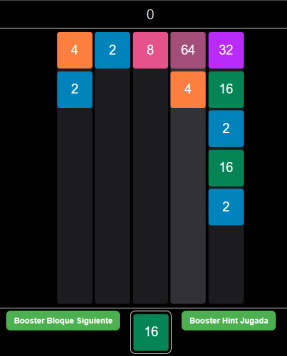

**2.Combinación de Bloques**

**Descripción:** Un escenario donde múltiples bloques adyacentes con el mismo valor se combinan para formar un bloque de mayor valor.

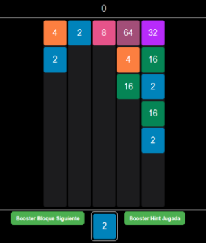 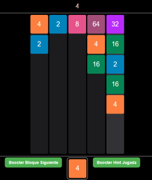

**3.Múltiples Combinaciones en Cascada**

**Descripción:** Un disparo que desencadena una secuencia de combinaciones, donde una combinación genera un nuevo bloque que a su vez se combina con otros, y así sucesivamente. Esto demuestra la recursividad de `resolver_pasos_juego`.

En este ejemplo. el bloque 2 se disparará a la segunda columna generando un nuevo bloque 8, que luego se combinará con el bloque 8 que está en la tercera columna.

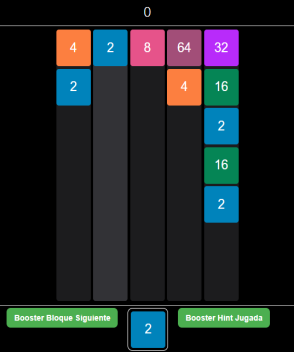 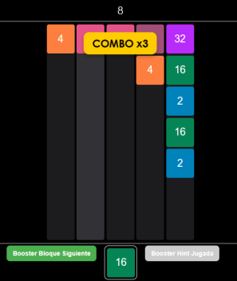

    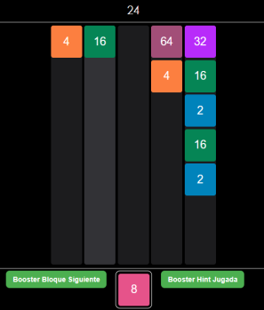

**4. Aviso de logro nuevo máximo alcanzado**

Descripción: Al lograr un nuevo bloque máximo, saldrá un aviso notificando dicho logro, en el cual dirá, por ejemplo: "¡Nuevo máximo alcanzado: 128!

    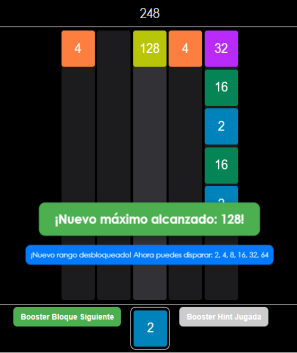

**5.Limpieza de bloques retirados**

**Descripción:** Un estado del juego donde el valor máximo ha alcanzado un umbral, y los bloques de bajo valor (por ejemplo, '2') son automáticamente retirados de la grilla.

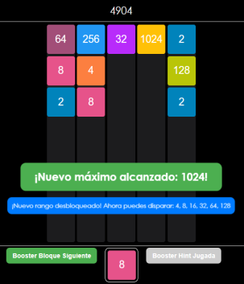 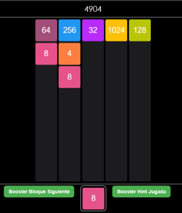

**6.Funcionamiento del Booster siguiente bloque**

**Descripción:** Al activarlo se muestra el bloque del disparo siguiente, además del actual. Puede activarse en cualquier momento, cuantas veces se quiera, y dura por un tiempo limitado de 5 segundos.

    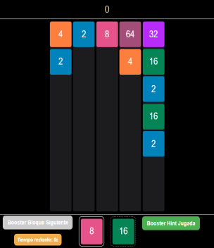

**7.Funcionamiento del Booster Hint Jugada**

**Descripción:** Al activarlo, se mostrará por cada columna cual es el resultado de la combinacion (si es que la hay) que se obtiene al disparar en dicha columna. Indicará el COMBO y PUNTAJE que se obtendrá.

    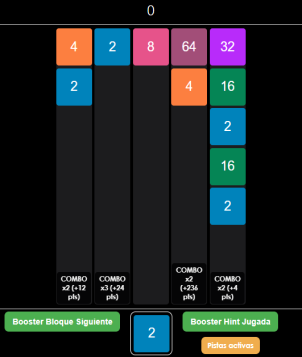

---

##### CONCLUSIÓN

La implementación combinada de Prolog y React ha demostrado ser una estrategia efectiva para desarrollar un juego con lógica compleja y una interfaz de usuario efectiva. Prolog facilitó la descripción de las reglas del juego y la toma de decisiones lógicas, mientras que React proporcionó una plataforma robusta, flexibilidad y eficiencia para construir una experiencia de usuario interactiva y visualmente atractiva.

Los desafíos encontrados durante el desarrollo, especialmente en el mecanismo de los efectos del juego, fueron superados mediante un diseño cuidadoso de la comunicación entre ambos componentes, resultando en un sistema coherente y funcional.
